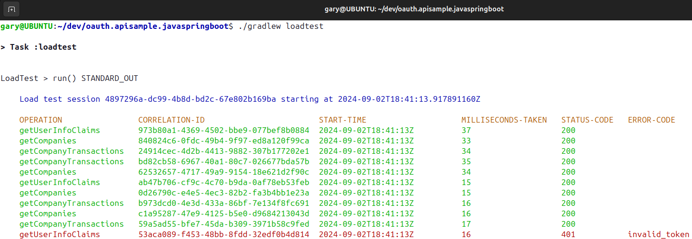

# Final Java Spring Boot API

[](https://app.codacy.com/gh/gary-archer/oauth.apisample.javaspringboot?utm_source=github.com&utm_medium=referral&utm_content=gary-archer/oauth.apisample.javaspringboot&utm_campaign=Badge_Grade)

[](https://snyk.io/test/github/gary-archer/oauth.apisample.javaspringboot?targetFile=build.gradle)

The final OAuth secured Java API code sample, which returns mock `investments` data:

- The API takes finer control over claims-based authorization to enable security with good manageability.
- The API uses structured logging and log aggregation, for the best supportability.

### API Serves Frontend Clients

The API can run as part of an OAuth end-to-end setup, to serve my blog's UI code samples.\
Running the API in this manner forces it to be consumer-focused to its clients:


### API Security is Testable

The API's clients are UIs, which get user-level access tokens by running an OpenID Connect code flow.\
For productive test-driven development, the API instead mocks the authorization server:


### API is Load Testable

A basic load test fires batches of concurrent requests at the API.\
This further verifies reliability and the correctness of API logs.



### API is Supportable

You can aggregate API logs to Elasticsearch and run [Technical Support Queries](https://github.com/gary-archer/oauth.blog/tree/master/public/posts/api-technical-support-analysis.mdx).


## How to Run the API

- Install a Java 21+ SDK.
- Also install Docker to run integration tests that use Wiremock.

Then run the API with this command:

```bash
./start.sh
```

### Configure DNS and SSL

Add these domains to your hosts file to configure DNS:

```text
127.0.0.1 localhost api.authsamples-dev.com login.authsamples-dev.com
```

Then call an endpoint over port 446:

```bash
curl -k https://api.authsamples-dev.com:446/investments/companies
```

Then configure [Java SSL trust](https://github.com/gary-archer/oauth.blog/tree/master/public/posts/developer-ssl-setup.mdx#trusting-a-root-certificate-in-java-apis) for the root CA at `./certs/authsamples-dev.ca.crt`.

```bash
sudo "$JAVA_HOME/bin/keytool" -import -alias authsamples.ca -cacerts -file ./certs/authsamples-dev.ca.crt -storepass changeit -noprompt
```

Clean up after testing with this command:

```bash
sudo "$JAVA_HOME/bin/keytool" -delete -alias authsamples.ca -cacerts -storepass changeit -noprompt

```

### Test the API

Stop the API, then re-run it with a test configuration:

```bash
./testsetup.sh
```

Then run integration tests and a load test:

```bash
./gradlew test
./gradlew loadtest
```

## Further Details

* See the [API Journey - Server Side](https://github.com/gary-archer/oauth.blog/tree/master/public/posts/api-journey-server-side.mdx) for further information on the API's behaviour.
* See the [Overview Page](https://github.com/gary-archer/oauth.blog/tree/master/public/posts/java-spring-boot-api-overview.mdx) for further details on how to run the API.
* See the [OAuth Integration Page](https://github.com/gary-archer/oauth.blog/tree/master/public/posts/spring-boot-api-oauth-integration.mdx) for some implementation details.

## Programming Languages

* The API uses Java 21 and Spring Boot 3.

## Infrastructure

* Tomcat is the HTTP server that hosts the API endpoints.
* AWS Cognito is the API's default authorization server.
* The [jose4j](https://bitbucket.org/b_c/jose4j/wiki/Home) library manages in-memory JWT validation.
* The project includes API deployment resources for Docker and Kubernetes.
