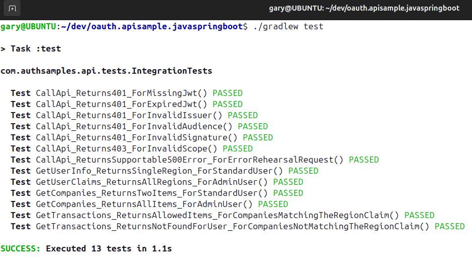

# Final Java Spring Boot API

[](https://app.codacy.com/gh/gary-archer/oauth.apisample.javaspringboot?utm_source=github.com&utm_medium=referral&utm_content=gary-archer/oauth.apisample.javaspringboot&utm_campaign=Badge_Grade)
[](https://www.codacy.com/gh/gary-archer/oauth.apisample.javaspringboot/dashboard?utm_source=github.com&amp;utm_medium=referral&amp;utm_content=gary-archer/oauth.apisample.javaspringboot&amp;utm_campaign=Badge_Grade)

[](https://snyk.io/test/github/gary-archer/oauth.apisample.javaspringboot?targetFile=build.gradle)

## Behaviour

The final OAuth secured Java API code sample, referenced in my blog at https://authguidance.com:

- The API has a fictional business area of `investments`, but simply returns hard coded data
- The API takes finer control over OAuth and claims to enable the best security with good manageability
- The API uses structured logging and log aggregation, for the best supportability

### API integrates with UI Clients

The API can run as part of an OAuth end-to-end setup, to serve my blog's UI code samples.\
Running the API in this manner forces it to be consumer focused to its clients:


### API can be Productively Tested

The API's clients are UIs, which get user level access tokens by running an OpenID Connect code flow.\
For productive test driven development, the API instead mocks the Authorization Server:



### API can be Load Tested

A basic load test uses Completable Futures to fire 5 parallel requests at a time at the API.\
This ensures no concurrency problems, and error rehearsal is used to ensure useful error responses:


### API is Supportable

API logs can be analysed in use case based manner by running Elasticsearch SQL and Lucene queries.\
Follow the [Technical Support Queries](https://authguidance.com/2019/08/02/intelligent-api-platform-analysis/) for some people friendly examples:


## Commands

First ensure that a Java 17+ SDK is installed.

### Run the API

Then run the API in isolation with this command:

```bash
./start.sh
```

### Configure DNS and SSL

Configure DNS by adding these domains to your hosts file:

```text
127.0.0.1 localhost apilocal.authsamples-dev.com login.authsamples-dev.com
```

Then call an endpoint over port 446:

```bash
curl -k https://apilocal.authsamples-dev.com:446/investments/companies
```

Configure SSL trust by running this command:

```bash
sudo "$JAVA_HOME/bin/keytool" -import -alias authsamples.ca -cacerts -file ./certs/authsamples-dev.ca.pem -storepass changeit -noprompt
```

### Test the API

Stop the API, then re-run it with a test configuration:

```bash
./testsetup.sh
```

Then run integration tests and a load test:

```bash
./gradlew test --rerun-tasks
./gradlew loadtest --rerun-tasks
```

## Further Details

* See the [API Journey - Server Side](https://authguidance.com/api-journey-server-side/) for further information on the API behaviour
* See the [Overview Page](https://authguidance.com/java-spring-boot-api-overview/) for further details on running the API
* See the [OAuth Integration Page](https://authguidance.com/java-spring-boot-api-coding-key-points/) for the security implementation


## Programming Languages

* Java 17 and Spring Boot 3 are used to implement the REST API

## Infrastructure

* The Tomcat web server hosts the API over SSL
* AWS Cognito is used as the default Authorization Server
* The [jose4j library](https://bitbucket.org/b_c/jose4j/wiki/Home) is used to manage in memory validation of JWTs
* The project includes API deployment resources for Docker and Kubernetes
